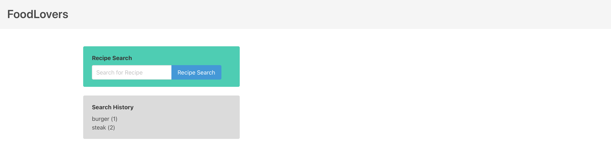

# Project 1

Github deployed link: https://alviszheng.github.io/food-lovers/

## Objective

* Use a CSS framework other than Bootstrap.

* Be deployed to GitHub Pages.

* Be interactive (i.e., accept and respond to user input).

* Use at least two server-side APIs.

* Does not use alerts, confirms, or prompts (use modals).

* Use client-side storage to store persistent data.

* Be responsive.

* Have a polished UI.

* Have a clean repository that meets quality coding standards (file structure, naming conventions, follows best practices for class/id naming conventions, indentation, quality comments, etc.).

* Have a quality README (with unique name, description, technologies used, screenshot, and link to deployed application).

* Finally, you must add your project to the portfolio that you created in Module 2.

## Server APIs

* Cloudflare CSS stylesheet
* Nutritionix API
* Mealdb recipe API

## Github

* Github repository URL: https://github.com/alviszheng/food-lovers

## Project images 

